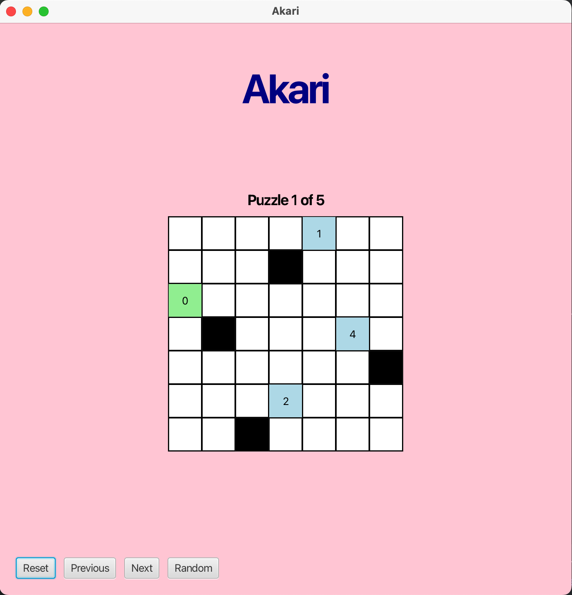

# Akari

This project was built with JavaFX, and implements [Akari](https://en.wikipedia.org/wiki/Light_Up_(puzzle)), a [logic puzzle](https://www.puzzle-light-up.com/) with a similar feel to Sudoku or Minesweeper. It is structured around the Model–View–Controller design pattern described in _Design Patterns: Elements of Reusable Object-Oriented Software_.

## Preview

## To Install:

1. Make sure you have the required dependencies installed:
- [Maven](https://maven.apache.org/guides/index.html)
- [JavaFX](https://openjfx.io/openjfx-docs/)
- [JUnit](https://docs.junit.org/current/user-guide/)

2. `git clone` this repository.
3. Open the project in an IDE that has Maven support ([IntelliJ](www.jetbrains.com/idea/download/) is recommended!)

## To Use:

Use built-in support for Maven plugins to run `javafx:run` to start the game.

-----

This project is open-source and available under the [MIT License](https://opensource.org/license/mit).